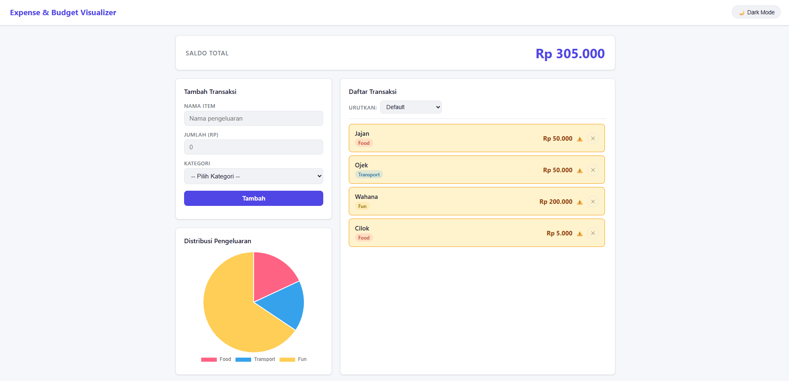
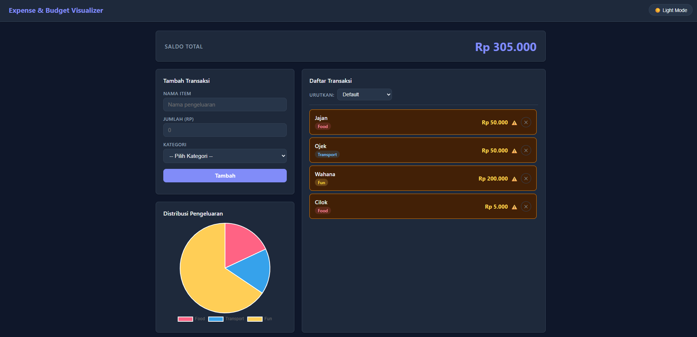

# Expense & Budget Visualizer

Aplikasi web untuk mencatat dan memvisualisasikan pengeluaran pribadi. Dibangun dengan HTML, CSS, dan Vanilla JavaScript murni — tanpa framework, tanpa backend.

## Screenshot
 
 

## Live Demo
https://zennmhtr.github.io/CodingCamp-30Mar26-zenn

## Tech Stack

- HTML5
- CSS3 (Custom Properties, Grid, Flexbox)
- Vanilla JavaScript (ES6+)
- [Chart.js](https://www.chartjs.org/) via CDN
- Browser Local Storage API
